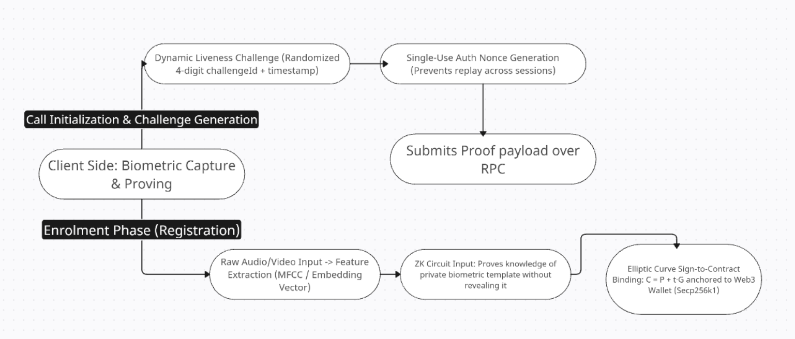
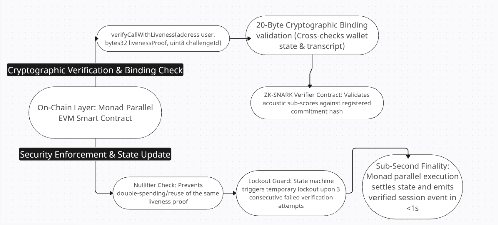

# Aegis · ZK Doğrulamalı Canlı Arama Doğrulama (Monad Testnet)

Deepfake ve replay saldırılarına karşı **biyometrik bir temele kriptografik olarak
bağlı** canlı arama doğrulama MVP'si.

Next.js (App Router) + Tailwind v4 + Wagmi/Viem + Solidity, üstelik **ham ses
tarayıcıdan hiç çıkmıyor**: dışarıya giden tek şey 32 baytlık bir kanıt
sözcüğüdür.

```
┌─ Tarayıcı (prover) ─────────────────────────────────────────────┐
│  mikrofon → MFCC embedding → ┌───────────────────────────────┐   │
│                             │ biyometrik anahtar bağlama     │   │
│                             │ C = P + t·G  (sign-to-contract)│  │
│                             └───────────────────────────────┘   │
│  canlı challenge → akustik liveness skorları → BIP-340 imza    │
│                     → 32 baytlık proof word                    │
└──────────────────────────────┬─────────────────────────────────┘
                               │  registerBaseline(user, C)
                               │  verifyCallWithLiveness(user, proof, id)
                               ▼
                   ┌───────────────────────────────┐
                   │  AegisCallZK · Monad Testnet  │
                   │  (chainId 10143)              │
                   │  oturum defteri + audit izi   │
                   └───────────────────────────────┘
```

---

## Mimari akış

### Tarayıcı tarafı — enrolment ve challenge üretimi



Bu diyagramın her kutusu kodda karşılığı var:

| Diyagramdaki kutu | Nerede |
|---|---|
| Raw Audio/Video Input | `lib/audio/recorder.ts` — AudioWorklet, `getUserMedia({ audio })`. **Video yok.** |
| Feature Extraction (MFCC / Embedding Vector) | `lib/audio/features.ts` |
| ZK Circuit Input | **Karşılığı yok** — aşağıya bakın |
| Elliptic Curve Sign-to-Contract, `C = P + t·G` | `lib/zk/biometricKey.ts` — `@noble/curves` secp256k1 |
| Dynamic Liveness Challenge (4 haneli + zaman damgası) | `lib/zk/challenges.ts` — 8 şablonluk banka, 60 sn TTL |
| Single-Use Auth Nonce Generation | `AegisCallZK.authNonce` — her doğrulamada artar |
| Submits Proof payload over RPC | `lib/chain/useAegis.ts` — `verifyCallWithLiveness` |

### Zincir tarafı — kriptografik doğrulama ve bağlama



| Diyagramdaki kutu | Nerede |
|---|---|
| `verifyCallWithLiveness(address,bytes32,uint8)` | `contracts/src/AegisCallZK.sol` — imza birebir |
| 20-Byte Cryptographic Binding validation | `_expectedBinding()` — `bytes20(keccak256(DOMAIN, C, user, challengeId, authNonce))` |
| **ZK-SNARK Verifier Contract** | **Karşılığı yok** — aşağıya bakın |
| Nullifier Check | `authNonce` artışı + oturum sıfırlama; aynı kanıt ikinci kez kabul edilmez |
| Lockout Guard (3 başarısız deneme) | `MAX_FAILED_ATTEMPTS` |
| Sub-Second Finality | Monad paralel yürütme; `LivenessVerified` / `LivenessRejected` event'i |

### Diyagram ile uygulamanın uyuşmadığı iki kutu

Şu iki kutu diyagramda var, kodda yok. Sessizce geçmiyorum:

**1. "ZK Circuit" / "ZK-SNARK Verifier Contract"**

Bu projede bir devre (circuit) ve bir SNARK doğrulayıcı kontrat **yok**. Yerine gerçek
bir kriptografik ilke uygulanıyor: sign-to-contract ile türetilen secp256k1 anahtarı.
Fark şurada:

| | Diyagramın ima ettiği | Bu projede olan |
|---|---|---|
| Kanıtın doğrulayıcıya ulaşan kısmı | akustik alt skorlar | 32 baytlık kanıt sözcüğü |
| Gizlilik | devre kanıtlar, template hiç açılmaz | template **zaten hiç gönderilmiyor**; gizlilik kriptografik değil, yapısal |
| Commitment | commitment hash | x-only public key (C = P + t·G) |
| Zincirin güvendiği şey | SNARK kanıtı | yeniden hesaplanan 20 baytlık binding + eşik karşılaştırması |

Yani gizlilik iddiası **geçerli** — template cihazda kalıyor, dışarı yalnızca commitment ve
skorlar çıkıyor — ama bunu bir devre kanıtlamıyor; şifreleme katmanının kendisi sağlıyor.
Ayrıntı: §7.1.

**2. "Raw Audio/Video Input"**

Video kanalı yok. `getUserMedia` yalnızca ses ister ve `video: false` verilir.

Diyagramın geri kalanı — challenge tazelik mekanizması, authNonce, 20 baytlık binding,
lockout ve `C = P + t·G` bağlama ilkesi — kodla birebir örtüşüyor.

---

## 1. Hızlı başlangıç

```bash
# 1) bağımlılıklar
npm install
npm run contract:install

# 2) kontratı derle + kontrat testlerini koş
npm run contract:compile
npm run contract:test          # 35 test

# 3) frontend ↔ kontrat doğrulaması (parite + saldırı motoru)
npm run verify                 # 39 kontrol
npm run test:wallets           # 22 kontrol (EIP-6963 cüzdan keşfi)

# 4) .env.local
#    NEXT_PUBLIC_AEGIS_CONTRACT_ADDRESS=0x...

# 5) çalıştır
npm run dev
```

Tamamını tek komutta: `npm run check`

### Monad Testnet'e dağıtım

Tam adımlar, sorun giderme tablosu ve güvenlik notu için: **[DEPLOY.md](./DEPLOY.md)**

Kısa yol:

```bash
# 1) cüzdanı oluştur + faucet'ten fonla  ->  https://faucet.monad.xyz
# 2) contracts/.env
#      MONAD_TESTNET_PRIVATE_KEY=0x...
#      MONAD_TESTNET_RPC_URL=https://testnet-rpc.monad.xyz
# 3) kontratı dağıt
npx hardhat ignition deploy ignition/modules/AegisCallZK.ts --network monadTestnet
#    veya:  npm run contract:deploy
# 4) adresi .env.local'a yaz (deploy.js otomatik yazar) ve çalıştır
npm run dev
```

Ağ: `chainId 10143` · RPC `https://testnet-rpc.monad.xyz` · Explorer
<https://testnet.monadscan.com>

> ⚠️ `https://rpc.testnet.monad.xyz` birçok kılavuzda yazıyor ama **artık
> çözülmüyor**; doğru adres `testnet-rpc.monad.xyz`.

---

## 2. Güvenlik modeli

Bu bölüm, sistemin **gerçekte neyi garanti ettiğini** ve nedenini anlatır.
Reklam dili değil, kriptografik savunma düzlemleri.

### 2.1 Katman 1 — Biyometrik anahtar bağlama (asıl savunma)

Kayıt sırasında ses örneğinden bir `templateDigest` hesaplanır ve bu digest,
cihaz sırrıyla birlikte bir eliptik eğri anahtarına **bağlanır**
(sign-to-contract):

```
P = salt · G                                    salt = 32 bayt cihaz sırrı
t = H("AEGIS_BIOMETRIC_V1" ‖ H(template) ‖ P) mod n
C = P + t · G                                   ← zincire yazılan commitment
```

`C` zincir üzerinde sıradan bir 32 baytlık x-only secp256k1 public key gibi durur;
template asla açığa çıkmaz. Asıl önemli olan şu:

* `C`nin özel anahtarı `d = salt + t mod n`dir ve `t` **template'e bağlıdır**.
* Aynı template'i yeniden üreten biri `d`'yi bilir.
* Üretemeyen biri (derinfake, farklı insan, replay) **farklı bir anahtar**
  bilir — dolayısıyla `C`ye karşı geçerli bir BIP-340 imzası üretemez.

Bu, eşik puanlamasıyla kapatılamayacak bir mülk: puanı yükseltmek imzayı
geçerli kılmaz. Doğrulandı (`npm run verify`, bölüm 3):

```
✔ a DIFFERENT biometric template cannot sign against the registered key
```

### 2.2 Katman 2 — Liveness (canlı insan mı?)

Katman 1 "doğru cüzdan sahibi mi" sorusunu yanıtlar; katman 2 **"şu an,
burada, canlı bir insan mı"** sorusunu yanıtlar. `lib/audio/features.ts` +
`lib/zk/liveness.ts`:

| Kontrol | Ne ölçer | Hangi saldırıyı yakalar |
|---|---|---|
| MFCC benzerliği (40-dim, L2-normalize) | Konuşmacı doğru mu | **impostor** (başka bir insan) |
| Rezonans (read-and-react) süresi | Challenge göründükten sonra ilk konuşmaya kadar geçen süre | hazır cevabı anında yapan bot/TTS |
| Pitch jitter | Periyodlar arası tonlama salınımı (canlı ≈%0.5–3, vocoder ≈%0.1) | **TTS / vocoder** |
| Oto-korelasyon döngü skoru | Sinyal uzun gecikmelerde kendini tekrar ediyor mu | **replay / dikilmiş döngü** |
| PCM digest defteri | Bu ses daha önce gönderildi mi | **replay** |
| HNR, spektral düzlük, merkez, ZCR | Ses "sentetik" mi, "gerçek" mi | vocoder / dijital filtre |
| Hece patlaması, duraklama dağılımı | Gerçekten konuşma mı, tek bir ton mu | ton üretimi, yapıştırma |

### 2.3 Katman 3 — Tazelik (replay'ı öldürür)

Kanıt tek kullanımlıktır ve iki kez bağlıdır:

* **Zincirden `authNonce`** — her doğrulama sayacı bir artırır; aynı kelime
  ikinci kez gönderilemez (`StaleAuthNonce`).
* **20 baytlık `binding`** — kontrat bunu **kendisi** yeniden hesaplar:

  ```
  binding = bytes20(keccak256(abi.encode(DOMAIN, C, user, challengeId, authNonce)))
  ```

  Bu yüzden başka bir kullanıcının, başka bir baseline'ın, başka bir
  challenge'ın ya da önceki bir aramanın kanıtı hiçbir işe yaramaz.

Ayrıca imzalanan mesaj şunları içerir: `C · user · challengeId · challengeSeed
· authNonce · deadline · similarity · liveness · flags · audioDigest`. Yani
**skorlar ve saldırı bayrakları kriptografik olarak mühürlenmiştir**; istemci
yargıyı sonradan değiştiremez.

### 2.4 Katman 4 — Dayanıklılık

| Mekanizma | Nerede | Amaç |
|---|---|---|
| Challenge bankası + `challengeSetRoot` | kontrat | Sızan/kötüye kullanılan bir prompt id'si kapatılabilir; prompt'lar zincir entropisiyle tazelenir |
| 3 başarısız denemede lockout (15 dk) | kontrat | Skor motoruna kaba kuvvet (brute force) saldırısı |
| 1 saatlik yeniden kayıt beklemesi | kontrat | Cihaz ele geçirilse bile baseline ile "sıfırla ve deepfake yaz" döngüsü kurulamaz |
| Saldırıda **revert değil, kayıt** | kontrat | Her reddedilen deneme kalıcı audit izi bırakır; `LivenessRejected(reason, flags)` |
| Kanonik bit kontrolü | kontrat | `DirtyProofBits` — malleable kelime yok |
| Device secret depoda değil | istemci | Vault yalnızca `salt` + `templateDigest` tutar; imza anahtarı her seferinde türetilir |

---

## 3. Doğrulama (kanıtlanmış kısım)

### Kontrat testleri — `npm run contract:test` → **35 passing**

Kapsam: deployment, kayıt, mutlu arama, replay/ forgery direnci (9 senaryo),
kriptografik reddedişlerin kaydı, lockout, yeniden kayıt cooldown'u, sahip
ayarları ve **32 baytlık kelimenin round-trip'i**.

### Çapraz-dil doğrulaması — `npm run verify` → **39 passing** + `npm run test:wallets` → **22 passing**

`scripts/verify-frontend.mjs`, tarayıcı TypeScript'ini `tsc` ile derleyip
Node'da **çalıştırır** ve gerçekten dağıtılmış kontrata karşı sınar:

1. **Parite** — `lib/zk/pack.ts`'in ürettiği kelime ve binding, Solidity'nin
   ürettiğiyle bayt bayt aynı. Tek bir endian kayması her gerçek çağrıyı
   `BaselineBindingMismatch` ile kırardı ve sadece zincirde belli olurdu.
2. **Saldırı motoru** — `lib/zk/spoof.ts` saldırgan sesini üretir ve
   **değiştirilmemiş** dedektörden geçirir; her saldırı sınıfının gerçekten
   yakalandığı doğrulanır. Kırmızı göremeyen bir güvenlik ürünü, çalışan bir
   güvenlik ürününden ayırt edilemez.
3. **Anahtar bağlama** — farklı template'in kayıtlı anahtara karşı imza
   üretemediği.

Bu süreçte bulunan ve düzeltilen gerçek hatalar:

| Hata | Etkisi |
|---|---|
| Solidity `bytes32 → bytes20` **sol** 20 baytı alıyor | Her kanıt `BaselineBindingMismatch` ile reddediliyordu |
| `new Uint8Array(int16Array)` buffer'ı **görüntülemez**, kopyalar ve bayt başına kırppar | PCM digest'i çöp üzerinden hesaplanıyordu → replay defteri sessizce işe yaramazdı |
| Re-enrol cooldown'u lockout olarak da kullanılıyordu | Yeni kayıt olan **hiçbir kullanıcı ilk 1 saat arama doğrulayamıyordu** |
| Döngü dedektörü toplam enerjiye bölüyordu | 1.7 s'lik kusursuz döngü 3 s'lik kayıtta yalnızca 0.45 puan alıyordu |
| Cevap gecikmesi kayıt başından ölçülüyordu | "Okuma ve tepki" penceresi hiç ölçülemiyordu → TEMPO_SPOOF işe yaramıyordu |
| noble'a `0x`'li hex geçiliyordu | Tip imzaları aksine çalışma zamanında reddediyor; imza üretimi çöküyordu |
| Cüzdan keşfi ilk `announceProvider`'da duruyordu | **Birden çok cüzdan kuruluysa yalnızca biri görünüyordu** — EIP-6963 her cüzdana aynı istek olayını yanıtlar, ilk yanıtta kapanmak diğerlerini gizliyordu |
| `getFloatTimeDomainData` her 8 ms'de **tüm pencereyi** ekliyordu | Örnekler ~16 kez tekrarlanıyor, 3,2 sn yerine ~0,33 sn kayıt alınıyor ve sinyale 125 Hz'lik yapay periyod giriyordu |
| `noiseSuppression`/`echoCancellation`/`autoGainControl` açıktı | Tarayıcı DSP'si tam olarak anti-spoofing'in ölçtüğü sinyalleri bastırıyor |
| Pitch 25 ms'lik MFCC karesinde hesaplanıyordu | 120 Hz'de yalnızca ~3 periyot → güvenilmez, düşük SNR'de pitch 0 dönüyordu |
| Oktav-aşağı hatası düzeltilmemişti | 140 Hz'lik ses 70 Hz okunuyordu (ölçülen ortalama: 102,7 Hz) |
| Kayıt eşikleri gain'e bağlı mutlak değerlerdi | Sessiz ama geçerli mikrofonlar reddediliyordu; kullanıcı "yüksek sesle konuşuyorum" diyordu ama `rms` 0,01'in altında kalıyordu |

### Cüzdan keşfi testleri — `npm run test:wallets` → **22 passing**

`scripts/verify-wallets.mjs`, EIP-6963'ün yaptığı yanıtı taklit eden sahte bir
event target ile keşif protokolünü tarayıcısız sınar: iki cüzdan birlikte
kurulu, yinelenen `announce` tekilleştirmesi, `window.ethereum` fallback'i,
hiç cüzzanın olmaması ve marka/monogram kataloğu.

### Kayıt / liveness regresyon testleri — `npm run test:capture` → **26 passing**

`scripts/verify-capture.mjs`, tarayıcıda yaşanan "Kayıt kullanılamaz: no
reliable pitch detected" hatasını tarayıcısız olarak yeniden üretir ve düzeltmeyi
kanıtlar:

- `AnalyserNode` tuzağı modellenir: hatalı yol kaydı 1920 örnek periyotla
  ikiliyor (kendiliğinden benzerlik 0,85), düzeltilmiş yol < 0,5
- 25 ms ve 50 ms pitch pencereleri düşük SNR'da karşılaştırılır
- oktav hatası: 140 Hz'lik sinyal 140 Hz olarak okunuyor
- kazanç normalizasyonu: aynı konuşma 1× ve 0,15× kazancında **aynı kararı**
  veriyor, ama dijital sessizlik hâlâ reddediliyor

---

## 4. 32 baytlık kanıt sözcüğü

`AegisCallZK.sol` ↔ `lib/zk/pack.ts` ↔ `contracts/test/helpers.js` — üçü de
aynı düzeni paylaşır ve parity testiyle kilitlenir.

```
offset  boyut  alan                anlamı
0x00    1      version             == 1
0x01    1      challengeId         yanıtlanan challenge (bankada açık olmalı)
0x02    2      livenessBps         canlı insan güveni, 0..10.000
0x04    2      similarityBps       template eşleşmesi, 0..10.000
0x06    1      flags               saldırı bitfield
0x07    1      sigAnchor           uint8(keccak256(sigR ‖ sigS)[31])
0x08    4      authNonce           tek kullanımlık, zincirdeki değerle aynı olmalı
0x0C    20     binding             kontratın YENİDEN HESAPLADIĞı tazelik bağı
```

`flags` bit düzeni (`FLAG_*`):

| Bit | Değer | Anlam |
|---|---|---|
| 0 | 1 | `REPLAY` |
| 1 | 2 | `SYNTHETIC` |
| 2 | 4 | `TEMPLATE_DRIFT` |
| 3 | 8 | `TEMPO_SPOOF` |
| 4 | 16 | `CHALLENGE_MISMATCH` |
| 5 | 32 | `MIC_SPOOF` |

UI'daki **Proof Inspector** bu kelimeyi bayt bayt, imza transkriptiyle ve
akustik alt-skorlarla birlikte gösterir — yani bir denetçi hükmü elle
yeniden hesaplayabilir.

---

## 5. Arayüz akışı

**Cüzdan.** Sağ üstteki **Cüzdanı bağla** düğmesi bir modal açar:

* **Cüzdan kuruluysa** her cüzdan **gerçek logosuyla** listelenir (logolar
  EIP-6963 `info.icon` data-URI'lerinden gelir — dış istek yok, marka görselleri
  bayatlamaz) ve `rdns` kimliğiyle gösterilir. Birden fazla cüzdan kuruluysa
  hepsi ayrı kart olarak çıkar; kullanıcı istediğini seçer.
* **Hiç cüzdan yoksa** modal kurulum yönlendirmesi verir: MetaMask / Rabby /
  Trust / Brave için doğrudan indirme bağlantıları. Ana konsolda da aynı
  uyarı şeridi görünür, böylece kullanıcı butona uğramadan yönlendirmeyi görür.
* Sekmeye geri dönüldüğünde tarama otomatik tekrar yapılır; "Yeniden tara"
  düğmesi de var (kurulumdan sonra beklemeden).

Ayrıntı: `lib/wallets/discovery.ts`. Protokol I/O'su React'ten ayrı
(`createWalletProbe`) tutuldu, bu yüzden tarayıcısız test edilebiliyor.

**Adım 1 — İlk kayıt.** Cüzdanı bağla → `🎙️ Biyometrik Baseline Kaydet` →
3.2 sn konuşma kaydedilir → tarayıcıda MFCC embedding + `C = P + t·G` üretilir →
`registerBaseline(user, C)` gönderilir. Ham ses ve embedding yalnızca
cihazdadır.

**Adım 2 — Canlı arama.** `📞 Start Secure Call` → zincirden `nextChallengeSeed`
ile taze bir challenge (4 haneli **dinamik kod** + ek bir belirteç) üretilir →
kullanıcı cevaplar → MFCC + akustik skorlar → 32 baytlık kelime imzalanır →
`verifyCallWithLiveness` gönderilir.

**Sonuç.**

* yeşil: `🟢 ZK-Verified Human: Baseline & Liveness Matched`
* kırmızı: `🚨 Deepfake / Replay Attack Detected!` + hangi kontrolün
  tetiklendiğinin insan-okunur açıklaması + Monadscan bağlantısı

Ayrıca **saldırı simülasyonu** düğmeleri vardır (replay / TTS / başka kişi).
Bunlar saldırgan sesi tarayıcıda sentezler ve **dedektörü hiçbir şekilde
değiştirmeden** aynı pipeline'dan geçirir — kırmızı yolun gerçekten çalıştığını
gösterir.

---

## 6. Dosya düzeni

```
app/                    layout, page, globals.css (Tailwind v4 tema token'ları)
components/
  AegisConsole.tsx      akışın orkestrasyonu
  StepViews.tsx         challenge kartı, stepper, oturum satırları
  WalletBar.tsx         cüzdan durumu + modal tetikleyici
  WalletModal.tsx       cüzdan listesi (logolar) / kurulum yönlendirmesi
  WalletLogo.tsx        logo, yoksa marka monogramı
  VoiceOrb.tsx          canlı mikrofon görselleştirmesi (canvas)
  VerdictBadge.tsx      yeşil/kırmızı karar rozeti
  ProofInspector.tsx    kanıt sözcüğü / transkript / akustik sekmeleri
  ui.tsx                Button, Panel, Pill, Meter …
lib/
  abi.ts                OTOMATİK ÜRETİLİR (contracts/scripts/export-abi.js)
  audio/
    dsp.ts              FFT, mel filterbank, DCT, F0
    features.ts         MFCC embedding + akustik öznitelikler + döngü dedektörü
    recorder.ts         mikrofon yakalama
  chain/
    monad.ts            Monad Testnet tanımı (10143)
    wagmiConfig.ts      wagmi + tek kayıtlı injected connector
    contract.ts         adres + eşikler
    useAegis.ts         oturum okuma, event decode, tx hook'ları
  wallets/
    discovery.ts        EIP-6963 keşfi (React'ten bağımsız probe) + connector
    catalog.ts          indirme bağlantıları + marka renkleri
  zk/
    primitives.ts       hash/hex/random + kanonik PCM digest
    biometricKey.ts     sign-to-contract, BIP-340 imza/doğrulama
    pack.ts             32 baytlık sözcük (Solidity ile birebir)
    challenges.ts       8'lik challenge bankası
    baseline.ts         ADIM 1: kayıt kanıtı
    liveness.ts         ADIM 2: skor + kanıt montajı
    spoof.ts            saldırı sentezi (test harness)
    vault.ts            yerel witness deposu
scripts/
  verify-frontend.mjs   çapraz-dil doğrulama (parite + saldırı motoru)
  verify-wallets.mjs    EIP-6963 cüzdan keşfi testleri (tarayıcısız)
contracts/
  src/AegisCallZK.sol   kontrat
  test/                 35 test
  scripts/deploy.js     dağıtım
```

`lib/abi.ts` kontrat derlenene kadar **otomatik üretilmez** — kontratı
değiştirdiyseniz `npm run contract:abi` çalıştırın, aksi halde arayüz eski ABI ile
derlenir.

---

## 7. Bilinçli sınırlar (dürüstlük bölümü)

Bu bir MVP. Aşağıdakiler **kasıtlı** olarak basitleştirilmiştir ve üretime
geçmeden önce kapatılmalıdır.

### 7.1 "ZK" katmanı simülasyonudur

Kontrat, istemcinin bildirdiği `livenessBps` / `similarityBps` / `flags`
değerlerini **kabul eder** (eşikleri uygular, tazelik bağını yeniden hesaplar,
kaydeder). Gerçek ZK'da bu skorlar bir devre içinde hesaplanır ve üretilen
Groth16/PLONK kanıtını bir doğrulayıcı kontratı kontrol eder.

**Neyin gerçek olduğu:** biyometrik anahtar bağlama (katman 1) gerçek bir
eliptik eğri kriptografisi işidir ve imza üretimi/verifikasyonu gerçektir.
**Neyin simülasyon olduğu:** skorların *kanıt içinde* hesaplanması.

Yüzey bu şekilde tasarlandı — 32 baytlık public-signal sözcüğü + kullanıcı
başına durum makinesi — ki gerçek devreye geçiş **tek bir değişiklik** olsun:
`proveLiveness` snarkjs çıktısı üretsin, kontrata bir `verifyProof(bytes calldata)`
eklensin.

### 7.2 LocalStorage bir cüzdan kasası değildir

`lib/zk/vault.ts` gösteri amaçlıdır. Üretimde `salt`, cihaz keystore'ü ile
sarmalanmalıdır (WebAuthn PRF, Secure Enclave, Android Keystore) ve çıkarılamaz
olmalıdır. Şu an XSS'e açıktır.

### 7.3 Eşikler gerçek sesle kalibre edilmelidir

`LIVENESS_THRESHOLDS` içindeki `similarityFloor: 0.72` / `similarityStrong: 0.88`
değerleri **sentetik bir korpustan** ölçüldü ve gerçek konuşma üzerinde
yeniden ölçülmelidir. Yanlış kalibrasyonun iki maliyeti vardır: eşiği çok yüksek
tutmak meşru kullanıcıyı kilitler, çok düşük tutmak sahte sesi geçirir. Değerler
UI'da Proof Inspector'da canlı olarak gösterilir ki ayar körlemesin.

### 7.4 MFCC+iSTFT tek başına üretim için yetersizdir

20 katsayılı MFCC + istatistik, konuşmacı ayrımı için makul bir MVP tabanıdır
ama modern embedding modeli (ECAPA-TDNN / x-vector) kadar güçlü değildir. Gerçek
deepfake (yüksek kaliteli ses klonlama) MFCC eşleşmesini geçebilir — bu durumda
katman 1 (anahtar bağlama) devreye girer ve klonlayan taraf aynı template'i
üretemediği için düşer.

### 7.5 Zamanlama ve replay defteri kapsamı

Replay defteri `localStorage`'daki digest listesidir; tarayıcı temizlenirse
sıfırlanır. Üretimde bu, oturum geçmişinden türetilen bir Merkle/sonlu alan
veya zincir üstü bir sayaç olmalıdır. Zamanlama kontrolleri de cihaz saatine
dayanır; üretimde güvenilir zaman (challenge'ın `deadline`ı kontratta zaten
var) kullanılmalıdır.

### 7.6 Zincir

`LivenessRejected` bir **revert değildir**; bu bilinçlidir (kalıcı audit izi).
Dolayısıyla reddedilen bir çağrı da gas ücreti öder. Düşmanın cebini tek bir
kötüye kullanılan çağrıyla yakmamak için üretimde bir **relay/raporlama katmanı**
(kendi çağrısını gönderen, kötüye kullanılanı raporlayan) önerilir.

---

## 8. Üretim yol haritası

1. `salt` → WebAuthn PRF ile sarmalanmış cihaz sırrı (PRF yerine girmeden
   "ZK" iddiası eksik kalır).
2. `t`, benzerlik ve liveness kontrollerini bir zk-circuit'e taşı; snarkjs/
   rapidsnark ile Groth16 kanıtı; kontrata `verifier` ekle.
3. `templateDigest` üretiminde noisy/fuzzy bir kanıta (secure sketch / fuzzy
   extractor) geç — iki ayrı kayıt aynı template digest'ini vermek zorunda
   kalmamalı.
4. Konuşmacı embedding'ini ECAPA-TDNN ile değiştir; eşikleri gerçek
   konuşma + ASVspoof2019/DFDeepfake2019 korpuslarıyla kalibre et.
5. Düşman tarafı analizi: homomorfik/uzak ölçüm (voice anti-spoofing için
   yardımcı veri), challenge response süresi istatistiği, cihaz/integrite
   sinyalleri.

---

## 9. Referanslar

- **BIP-340** — Schnorr imzaları (kullandığımız imza şeması)
- **Sign-to-contract / Signpass** — biyometrik template'i public key'e bağlama
  deseni (`C = P + t·G`)
- **AegisCallZK.sol** — kontratın kendi dokümantasyonu güvenlik gerekçesini
  satır satır anlatır
- Monad Testnet: <https://docs.monad.xyz/developer-essentials/testnet>
